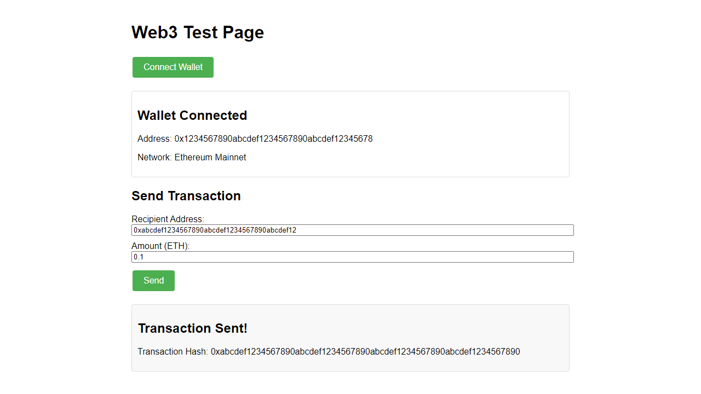

#  Web3FuzzForge Security Testing Kit

[](https://www.npmjs.com/package/web3fuzzforge)
[](LICENSE)
[](https://docs.web3fuzzforge.dev)
[](https://playwright.dev)
[](src/utils/SECURITY.md)
[](https://github.com/[your-username]/web3-security-test-kit/actions/workflows/playwright.yml)
[](https://github.com/[your-username]/web3-security-test-kit/actions/workflows/docs-deployment.yml)
[](https://github.com/[your-username]/web3-security-test-kit/actions/workflows/security-scan.yml)
[](https://github.com/[your-username]/web3-security-test-kit/actions/workflows/release.yml)



A comprehensive toolkit for testing Web3 dApps, focusing on security and functional testing.

📚 **[Full Documentation](https://docs.web3fuzzforge.dev)** - Visit our comprehensive documentation site for guides, tutorials, and reference materials.

## Key Features

- **🦊 Multi-Wallet Support** - Test with MetaMask, WalletConnect, Coinbase, Phantom, and more
- **🔒 Security Testing** - Detect vulnerabilities with pre-built security test patterns
- **⚡ Automated Testing** - Generate tests with a single command
- **💾 Wallet Snapshots** - Save and restore wallet states for complex test scenarios
- **🧩 TypeScript Support** - Full TypeScript compatibility for all templates
- **🎭 Playwright Integration** - Built on the powerful Playwright testing framework

## Quick Demo

Run a sample test connecting MetaMask to Uniswap:

```bash
# Install dependencies and Playwright browsers
npm install
npx playwright install

# Run the sample test in headed mode (shows browser)
npx playwright test tests/sample-metamask-connect.test.js --headed
```

## Security Features

This project includes enhanced security features to protect your Web3 testing environment:

- **Dependency Vulnerability Mitigation** - Hardened dependencies with version pinning
- **Dappeteer Security Wrapper** - Enhanced wallet automation with security checks
- **Secure by Default** - Enforces secure connection URLs and provides extra validation

To update security features, run:

```bash
# Check and fix security issues
npm run security:fix

# Update dependencies safely
node package-security-update.js
```

See [SECURITY.md](src/utils/SECURITY.md) for more details on our security strategy.

## Documentation

The project documentation is built with Docusaurus and available at [docs.web3fuzzforge.dev](https://docs.web3fuzzforge.dev).

### Running the documentation locally

```bash
# On Windows
cd docs-site
npm install
npm start

# Deploy (Windows)
.\deploy-docs.ps1

# Deploy (macOS/Linux)
chmod +x deploy-docs.sh
./deploy-docs.sh
```

## Setup & Installation

### Local Installation (Recommended)

This project has a pre-packed `.tgz` file that you can install locally:

```bash
# Install dependencies
npm install

# Install the web3fuzzforge package locally
npm run local-install
```

### Alternative: Using Local Commands

If you encounter issues with the package installation, you can use these direct command alternatives:

```bash
# Generate a connection test
npm run forge:gen connect -- --wallet metamask --out ./tests/connection-test.js

# Run tests in mock mode
npm run forge:run -- --mock-mode --headed
```

## CLI Help Output

```
Usage: web3fuzzforge <command> [options]

Commands:
  generate       Generate test templates
  run            Run test suite
  doctor         Check environment setup
  snapshot       Create and manage wallet snapshots
  fuzz           Run fuzz testing on dApp
  help           Show help for a command

Options:
  -v, --version  Show version number
  -h, --help     Show help

Examples:
  web3fuzzforge generate connect --wallet metamask --out ./tests/connection.test.js
  web3fuzzforge run --mock-mode --headed
  web3fuzzforge doctor

For detailed documentation, visit: https://docs.web3fuzzforge.dev
```

## Usage

### Generate Test Templates

```

## Security Enhancements

This project includes several security enhancements:

1. **Custom Wallet Automation**:
   - A secure custom implementation that replaces @chainsafe/dappeteer
   - Built directly on Playwright without vulnerable dependencies
   - Full API compatibility with dappeteer for easy migration

2. **CI/CD Security Integration**:
   - Automated security scanning in GitHub workflows
   - Daily vulnerability checks with issue creation for critical findings
   - Dependency monitoring for new security advisories

3. **Dependency Monitoring**:
   - Dependabot configuration for automated security updates
   - Scheduled scanning of npm dependencies
   - Custom checks for critical Web3 dependencies

## Getting Started

### Installation

```bash
# Clone the repository
git clone <repository-url>
cd web3-security-test-kit

# Install dependencies and set up the environment
npm run setup
```

### Running Tests

```bash
# Run tests with the custom wallet implementation
npm run security:run-test:custom

# Run security checks
npm run security:scan
```

## Migration from Dappeteer

The project provides a smooth migration path from @chainsafe/dappeteer:

1. Start with the wrapper: `require('../src/utils/dappeteer-wrapper')`
2. Test with the custom implementation: `require('../src/utils/custom-wallet-automation')`
3. After validating, remove the dappeteer dependency

## Security Documentation

For detailed information about the security features, see:
- [Security Documentation](src/utils/SECURITY.md)
- [GitHub Workflows](.github/workflows/security-scan.yml)
- [Dependabot Configuration](.github/dependabot.yml)

## License

MIT

## New Features

### Interactive Setup

Web3FuzzForge now includes an interactive setup wizard to help you get started quickly:

```bash
npx web3fuzzforge init --interactive
```

This will:
- Automatically detect your project type (React, Vue, Hardhat, etc.)
- Guide you through configuring your testing environment
- Suggest appropriate templates based on your project
- Create a customized configuration file

### Improved Error Handling

We've significantly improved error messages and troubleshooting with:
- Clear, actionable error messages
- Specific solutions for common issues
- Automatic dependency checking
- Graceful degradation for missing components

Try the new doctor command to diagnose issues:

```bash
npx web3fuzzforge doctor
```

Or use with the `--fix` flag to automatically fix common problems:

```bash
npx web3fuzzforge doctor --fix
```

For detailed troubleshooting, see our [Troubleshooting Guide](docs/troubleshooting.md).