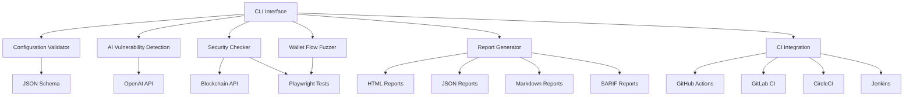
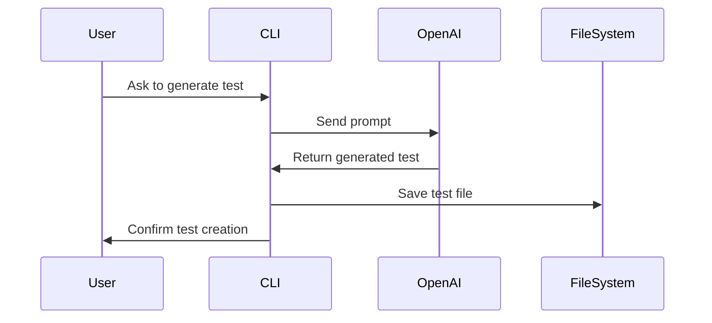
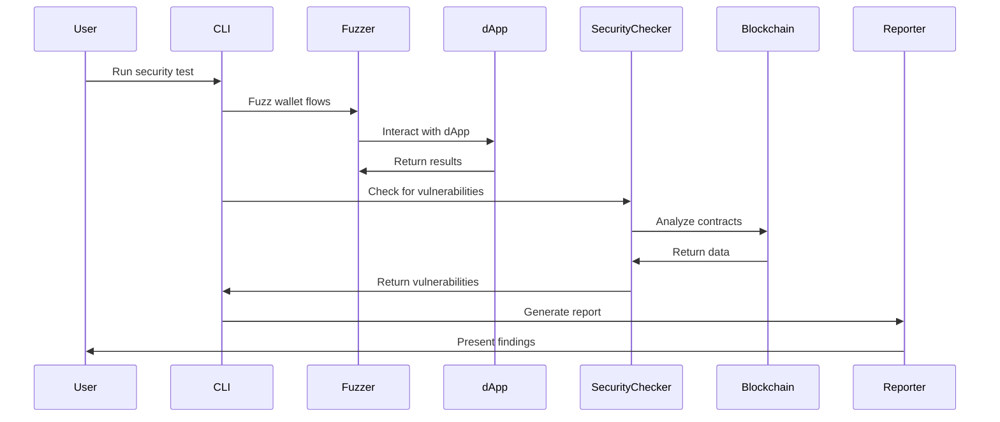
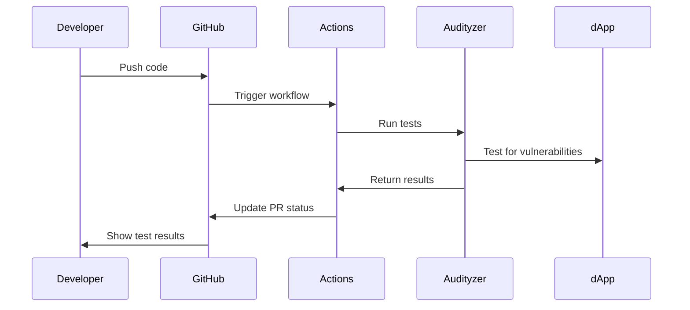
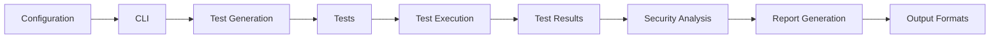

# Audityzer Architecture

## Overview

Audityzer is an intelligent security testing framework for Web3 applications and smart contracts. It provides automated testing, vulnerability detection, and reporting capabilities.

## System Components

## Workflow

1. **Configuration**: The system is configured using a JSON configuration file validated against a schema.
2. **Test Generation**: Tests can be generated manually or using AI assistance.
3. **Test Execution**: Tests are executed using Playwright against the target dApp.
4. **Security Analysis**: Smart contracts are analyzed for vulnerabilities.
5. **Reporting**: Results are compiled into comprehensive reports.
6. **CI Integration**: Tests can be integrated into CI/CD pipelines.

## Key Features

### AI-Assisted Test Generation

Audityzer uses OpenAI's GPT models to generate tests based on natural language descriptions of vulnerabilities or test scenarios.

### Security Testing

The security testing workflow involves multiple components working together:

### CI/CD Integration

Audityzer can be integrated into CI/CD pipelines for automated testing:

## Data Flow

## Deployment

Audityzer can be deployed in various environments:

1. **Local Development**: Run directly on a developer's machine
2. **CI/CD Pipeline**: Integrated into continuous integration workflows
3. **Security Audit**: Used by security teams for vulnerability assessments
4. **Continuous Monitoring**: Deployed for ongoing security monitoring

## Future Enhancements

- **Enhanced AI Models**: Integration with more specialized AI models for security
- **Real-time Monitoring**: Continuous monitoring of deployed contracts
- **Expanded Vulnerability Database**: More comprehensive vulnerability detection
- **Automated Remediation**: Suggestions for fixing detected vulnerabilities
- **Cross-chain Support**: Expanded support for multiple blockchains