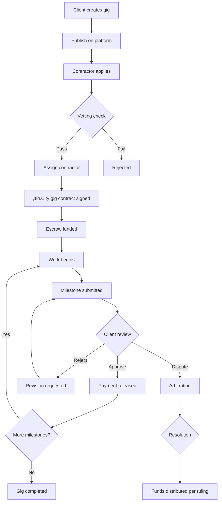
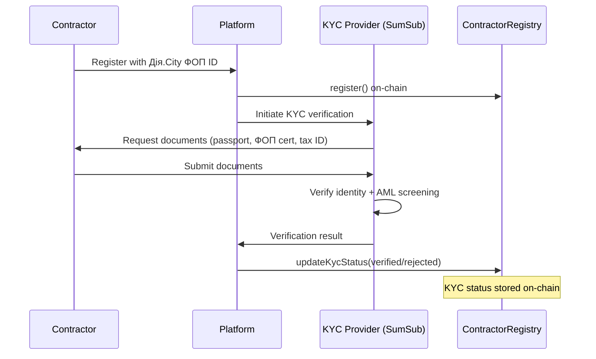
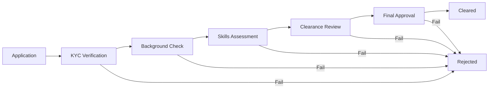
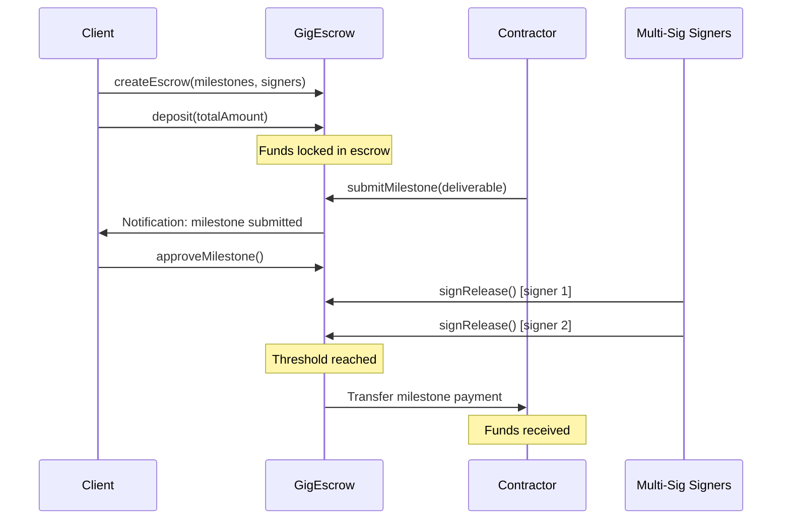
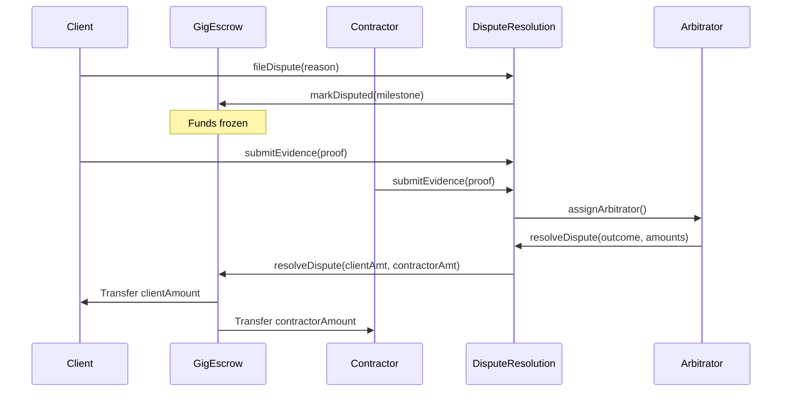
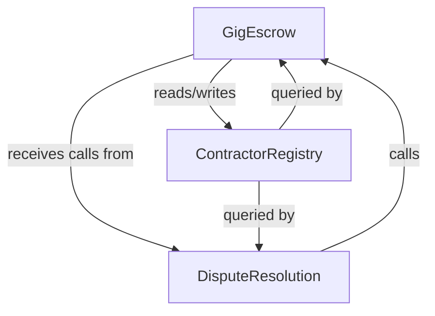

# Gig Contracts Framework — Specification

**Project:** AuditorSEC Track 3 — Automation & R&D
**Version:** 1.0.0
**Date:** 2026-03-13

---

## 1. Overview

The Gig Contracts Framework provides a blockchain-based platform for managing gig engagements between AuditorSEC and independent contractors, with special provisions for DefenseTech security-cleared work. The framework is designed for compliance with Ukraine's Дія.City gig contract regulations.

## 2. Legal Framework — Дія.City Alignment

### 2.1 Дія.City Gig Contract Model

Under Ukraine's Law on Stimulating the Development of the Digital Economy (Дія.City), companies can engage specialists via **гіг-контракти** (gig contracts) with the following characteristics:

- Contractor is a **ФОП** (sole proprietorship / фізична особа-підприємець) registered in Дія.City
- Tax regime: 5% income tax + single social contribution (ЄСВ)
- The relationship is civil-law, not employment
- IP created during the gig belongs to the client (unless otherwise specified)
- Dispute resolution follows civil procedure or arbitration as specified in contract

### 2.2 Platform Compliance

| Requirement | Implementation |
|-------------|----------------|
| Contractor must be registered ФОП | `diaCityFopId` field in ContractorRegistry |
| Tax ID verification | `taxId` field + KYC verification |
| Contract must specify scope and milestones | Milestone-based GigEscrow contract |
| Payment must be documented | On-chain transaction records |
| IP assignment | Deliverable hash stored on-chain |
| Dispute resolution | DisputeResolution contract with arbitration |

### 2.3 Contract Lifecycle under Дія.City

## 3. KYC/AML Integration

### 3.1 KYC Flow

### 3.2 AML Screening

| Check | Provider | Frequency |
|-------|----------|-----------|
| Identity verification | SumSub | On registration |
| Sanctions screening | SumSub + Chainalysis | On registration + quarterly |
| PEP screening | SumSub | On registration + annually |
| Wallet screening | Chainalysis KYT | On each transaction |
| Adverse media | SumSub | On registration + quarterly |

### 3.3 Wallet Compliance

Before any on-chain transaction, contractor and client wallets are screened via Chainalysis KYT (Know Your Transaction):

- No direct or indirect exposure to sanctioned entities
- No mixer/tumbler transactions above threshold
- No darknet market associations
- Risk score must be below configurable threshold

## 4. DefenseTech Security Clearance Workflow

### 4.1 Clearance Levels

| Level | Access Scope | Vetting Duration | Renewal |
|-------|-------------|-----------------|---------|
| None | Public gigs only | — | — |
| Confidential | Standard security gigs | 2–4 weeks | Annual |
| Secret | Sensitive defense projects | 4–8 weeks | Annual |
| Top Secret | Critical infrastructure / classified | 8–16 weeks | Semi-annual |

### 4.2 Vetting Pipeline

**Stage Details:**

1. **Application Submitted** — Contractor submits Дія.City ФОП docs + clearance request
2. **KYC Verification** — Identity, tax ID, and AML screening via SumSub
3. **Background Check** — Criminal record (via MVS API), credit history, employment verification
4. **Skills Assessment** — Technical evaluation (CTF challenges, code review, audit samples)
5. **Clearance Review** — SBU (Security Service of Ukraine) referral for Secret+ levels; BRAVE1 registry check for DefenseTech contractors
6. **Final Approval** — Multi-party sign-off (AuditorSEC security officer + client representative)

### 4.3 BRAVE1 Integration

For contractors working on EU4UA Defence Tech / BRAVE1 projects:
- Verify contractor registration in BRAVE1 ecosystem
- Cross-reference with Ministry of Digital Transformation records
- Ensure compliance with dual-use technology export controls

## 5. Payment Flow

### 5.1 Standard Payment Flow

### 5.2 Dispute Payment Flow

### 5.3 Supported Payment Tokens

| Token | Network | Use Case |
|-------|---------|----------|
| USDC | Ethereum / Polygon | Primary payment token |
| USDT | Ethereum / Polygon | Alternative stablecoin |
| DAI | Ethereum | Decentralized stablecoin option |
| ETH | Ethereum | Native token payments |
| UAH-CBDC | TBD | Future: NBU CBDC integration |

## 6. Smart Contract Architecture

### 6.1 Contract Dependency Graph

### 6.2 Access Control Matrix

| Function | Client | Contractor | Arbitrator | Admin | Escrow |
|----------|--------|------------|------------|-------|--------|
| createEscrow | x | | | x | |
| deposit | x | | | | |
| submitMilestone | | x | | | |
| approveMilestone | x | | | | |
| rejectMilestone | x | | | | |
| signRelease | | | | | Multi-sig |
| fileDispute | x | x | | | |
| submitEvidence | x | x | | | |
| resolveDispute | | | x | | |
| register | | x | | | |
| updateKycStatus | | | | KYC Provider | |
| updateClearance | | | | Clearance Officer | |
| updateReputation | | | | | x |

## 7. Gas Optimization Notes

- Specializations stored as bitmap (uint256) instead of string array
- Minimal on-chain storage; deliverables on IPFS with hash on-chain
- Batch operations for multi-milestone escrows
- Events used for off-chain indexing (The Graph subgraph)

## 8. Deployment Plan

### 8.1 Network Strategy

| Phase | Network | Purpose |
|-------|---------|---------|
| Development | Hardhat local | Testing |
| Testnet | Polygon Mumbai | Integration testing |
| Staging | Polygon Amoy | Pre-production |
| Production | Polygon PoS | Live platform |

### 8.2 Upgrade Strategy

- Contracts deployed behind TransparentUpgradeableProxy (OpenZeppelin)
- Timelock controller for upgrades (48h delay)
- Multi-sig governance for upgrade authorization

## 9. Security Considerations

- All contracts audited before mainnet deployment
- Reentrancy guards on all fund-transfer functions
- Access control via OpenZeppelin AccessControl
- Escrow funds can only be released via multi-sig or dispute resolution
- No admin can unilaterally withdraw escrowed funds
- Emergency pause functionality for critical vulnerabilities
